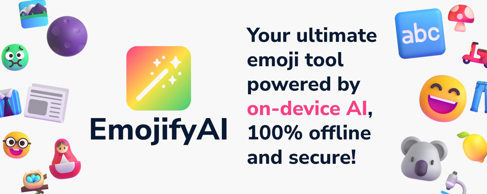

# EmojifyAI 🪄
Bring your text to life with EmojifyAI, the ultimate Google Chrome™ extension for emoji lovers.

Powered by the on-device Gemini™ Nano Model, EmojifyAI translates your text into emojis seamlessly and securely—no internet required, and no data ever leaves your device.

Whether you're looking to add flair to your messages or express yourself in a whole new way, EmojifyAI has you covered.

## Key Features 🎯
- **Three Modes of Fun** 🎮
    - **Translate🔤:** Convert selected text into emojis and copy the result to your clipboard.
    - **Replace🔁:** Replace selected text directly with its emoji translation.
    - **Enhance✨:** Add emojis to your text for extra personality.
- **Customizable Output 🎨:** Choose between a single emoji or multiple emojis for translations.
- **Right-Click Convenience 🖱️:** Access all features directly from the right-click menu for quick and easy use.
- **Offline Functionality 💻:** Runs entirely on your device, ensuring privacy and reliability.

## Note ⚠️
EmojifyAI leverages experimental Google Chrome™ features currently under active development. While we strive to provide a stable experience, occasional instability may occur as these features evolve.

## How to install ⬇️
### Install from Chrome Web Store 🛍️

### Manual Installation 🔧
1. Clone this repository
2. Navigate to `extension`
3. Rename `manifest_.json` to `mainfest.json`
4. Get your personal [origin trial token](https://developer.chrome.com/origintrials/#/view_trial/320318523496726529) and paste it into `trial_tokens`

## Licensing 📜

This project is licensed under the MIT License - see the [LICENSE](LICENSE) file for details.

### Third-Party Components
This project includes third-party components - see [THIRD-PARTY-NOTICES](THIRD-PARTY-NOTICES.txt) for details and attributions.